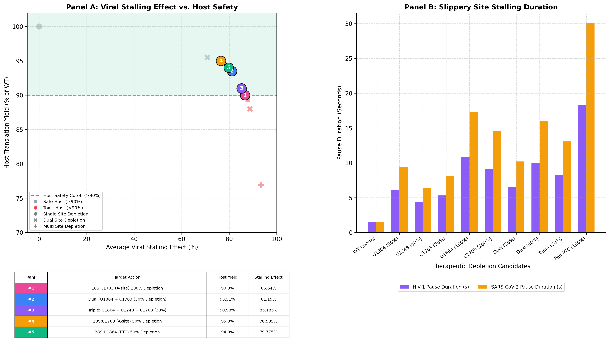

# rRNA Modification and Viral Translation Model

### Biophysical Simulation and Epsilon-Greedy Screening of rRNA Modification Depletions

## Project Overview

This project started with a simple goal — to predict the outcome of a biological experiment before performing it in the lab.

I wanted to investigate how changes in ribosomal RNA (rRNA) modifications might influence viral protein translation. However, I couldn't find an existing computational model that directly incorporated the specific rRNA modifications I wanted to investigate.

This led me to develop a Python-based biophysical simulation framework exploring the effects of rRNA modification depletion on ribosomal pausing at programmed frameshifting sites in HIV-1 and SARS-CoV-2.

The model also considers how these changes might affect normal host translation.

## How the Model Works

The framework combines several computational approaches.

- **Biophysical simulation** using thermodynamic assumptions and ribosomal dwell-time inputs to estimate changes in ribosomal pausing.
- **rRNA modification screening** evaluating selected single-site and combined modification-depletion scenarios.
- **Epsilon-greedy optimization** ranking candidate scenarios according to their predicted viral stalling effects and modeled host translation retention.
- **Data visualization** comparing predicted ribosomal behavior across different conditions.

The model evaluates ten predefined scenarios, including an unmodified wild-type control.

## Input Data and Limitations

The current model uses a combination of biological reference information, physical constants, estimated parameters, and simulated values.

The input files include

- `riboseq_dwell_times.csv` — Codon-specific dwell-time inputs.
- `ribosome_params.json` — Ribosomal and thermodynamic parameters.
- `rrna_modifications_curated.csv` — Selected rRNA modification sites and modeled energetic and functional parameters.
- `viral_frameshift_sites.json` — Viral frameshifting sites and associated model parameters.
- `viral_sequences.fasta` — Viral nucleotide sequences.

### Scientific Scope and Limitations

This project is an exploratory computational simulation intended to investigate how depletion of selected rRNA modifications might influence ribosomal pausing at viral programmed frameshift sites in HIV-1 and SARS-CoV-2. Some source annotations for input parameters still require independent verification.

The model uses assumed energetic and biological parameters where experimentally validated measurements are unavailable. The predicted stalling effects represent model-derived changes in ribosomal pause duration, not experimentally measured viral inhibition, frameshifting efficiency, or replication outcomes.

The 90% host translation retention threshold is a user-defined screening criterion and does not establish biological safety.

The Eyring-inspired kinetic model and the scaling of pause duration by RNA-structure energy barriers are simplified modeling assumptions requiring experimental validation. Candidate rankings should therefore be interpreted as hypotheses for future investigation rather than validated therapeutic targets.

## Installation and Usage

The project was developed using Python 3.12.

Install the required libraries.

```bash
pip install numpy pandas matplotlib seaborn
```

Keep `main.py` and all five input files in the same directory.

Run the program.

```bash
python main.py
```

The program prints a table of the five highest-ranking candidates that retain at least 90% of modeled host translation capacity.

It also generates a two-panel figure comparing

- **Panel A** — Average modeled viral stalling effect versus host translation retention.
- **Panel B** — Predicted ribosomal pause duration at HIV-1 and SARS-CoV-2 frameshifting sites.

The figure is saved to `output/Hybrid_MultiTarget_Annotated_Clean.png`.

## Reproducibility

Python and NumPy random seeds are fixed to 42 to support reproducibility of the candidate-ranking procedure.

## Future Development

The next stage of this project will focus on incorporating real experimental measurements to replace or calibrate estimated parameters and evaluate the model's predictive accuracy.

I also plan to explore more advanced machine learning approaches to better characterize the relationships between rRNA modifications, ribosomal dynamics, and viral translation.

The long-term goal is to develop a computational framework that can generate testable biological predictions and help guide future laboratory experiments.

## Project Status

**Under active development — experimental validation planned.**

## Simulation Results

The figure below shows the modeled effects of rRNA modification depletion on viral ribosomal pausing and host translation retention.



## Copyright and Usage

Copyright © 2026 Tom Tuval. All Rights Reserved.

This project is publicly available for viewing and educational reference. Permission from the copyright holder is required to copy, modify, redistribute, or reuse the code and associated original materials.
